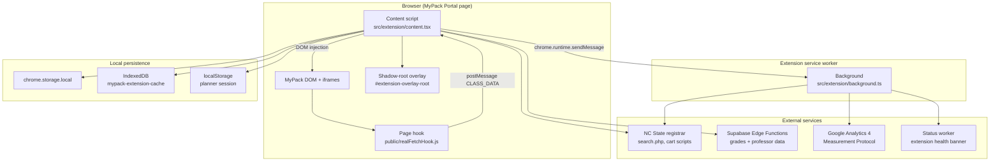

# MyPack Plus — Architecture & Design

This document explains how the MyPack Plus browser extension is structured, how data flows through it, and where to look when changing behavior. It is written for maintainers and contributors who need a mental model of the whole system, not just a single feature.

For UI surface inventory and redesign constraints, see [`UI_INVENTORY_AND_DESIGN_CRITERIA.md`](UI_INVENTORY_AND_DESIGN_CRITERIA.md).

---

## 1. Product overview

MyPack Plus is a **Manifest V3 Chrome extension** that augments NC State's MyPack Portal registration workflow. It runs inside supported MyPack pages and adds:

- **Course, GEP, and major/minor plan search** with section comparison
- **Schedule preview** against enrolled and carted classes
- **Historical grade distributions** and **professor ratings**
- **Add-to-cart helpers** for lecture + lab/recitation combinations
- **Local caching** so repeat searches stay fast

The extension is independent and is not affiliated with NC State University.

---

## 2. High-level architecture



### Runtime roles

| Component | File(s) | Responsibility |
|-----------|---------|----------------|
| Content script | `src/extension/content.tsx` | Bootstraps UI, injects hooks, listens for MyPack XHR data, mounts React overlay |
| Background service worker | `src/extension/background.ts` | Cross-origin POST proxy to registrar, analytics relay, status checks, cache clear on update |
| Page hook | `public/realFetchHook.js` | Patches `XMLHttpRequest` in page context to capture MyPack schedule/cart API responses |
| Planner UI | `src/ui-system/components/SlideOutDrawer.tsx` | Main “Pack Planner” dialog and launcher |
| Data layer | `src/course-management/` | Search, merge, cache, cart, calendar |
| In-page cards | `src/degree-planning/` | Grade/professor cards injected into MyPack planner rows |
| Staging app | `src/staging/` | Standalone Vite page for UI work without MyPack |

---

## 3. Bootstrap sequence

When a supported MyPack page loads, the content script runs at `document_start` (see `public/manifest.json`).

1. **Analytics bootstrap** (top frame only): `initializeAnalytics()` → background worker.
2. **`setupListener()`** from `siteResponseStorage.ts`: registers a `window.message` listener for hook payloads.
3. **`realFetchHook.js` injection** into the top document and into MyPack iframes (`PAGECONTAINER`, enrollment URLs). The hook must run in page context because content scripts cannot intercept page XHR directly.
4. **Shadow-root overlay creation** via `ensureOverlayContainer()` in `src/utils/dom.ts`:
   - Creates `#extension-overlay-root` with an open shadow root
   - Inlines Tailwind/extension CSS rewritten for `chrome-extension://` asset URLs
   - Attaches a style-order observer so Tailwind utilities win over host CSS bleed
5. **React mount**: `RootOverlayDialogs` renders `WhatsNewDialog`, `FirstStartDialog`, and `SlideOutDrawer`.
6. **Schedule scrape**: waits for `#scheduleTable`, then `scrapeScheduleTable()` to inject grade/prof cards into enrolled rows.
7. **Planner iframe click listener**: debounced `debouncedScrapePlanner()` when the user opens class sections in the cart/planner iframe.

The content script guards against double initialization with `window.__mypackEnhancerInitialized`.

---

## 4. Source layout

```
src/
├── extension/           # MV3 entry points (content + background)
├── ui-system/           # Shared planner UI, workbench, styles, themes
├── course-management/   # Search tabs, APIs, cache, cart, calendar
├── degree-planning/     # Plan types, injected audit cards, response storage
├── user-experience/     # Onboarding, status banner, release notes
├── generated/catalogs/  # Large static reference datasets (terms, GEP, majors)
├── components/ui/       # shadcn-style primitives (Button, Dialog, Tabs, …)
├── utils/               # DOM helpers, debounce, logger, course-search parsers
├── analytics/           # GA4 client + background relay
├── config/              # Supabase URL/key
├── types/               # Shared API response types
├── hooks/               # React hooks (e.g. useAutoSize)
├── lib/                 # cn() and small shared utilities
└── staging/             # Planner staging app (no CRX plugin in Vite)
```

### Naming note

The repo is mid-refactor from PascalCase paths (`SearchTabs/`, `CourseRetrieval.ts`) to kebab-case (`search-tabs/`, `courseRetrieval.ts`). Treat both as the same modules until the migration finishes; imports should follow whichever path exists in your branch.

---

## 5. Data pipelines

### 5.1 Course section search (planner tabs)

All three search tabs (`CourseSearch`, `GepSearch`, `MajorPlanSearch`) converge on the same merged section model.

```
User selects term + filters
        │
        ▼
dataService.ts (planner-search)
        │
        ├─► searchService.ts ──► background fetchData ──► registrar search.php
        │                              │
        │                              ▼
        │                    parseRegistrarUtil.ts (HTML → CourseData)
        │
        ├─► Supabase batch/single endpoints (grades + RateMyProf matches)
        │
        ▼
mergeDataUtil.ts
        │
        ├─► groupSections.ts (lecture + lab/rec grouping by NC State section numbering)
        │
        ▼
MergedCourseData / ModifiedSection
        │
        ▼
SectionCompareCard + CourseSectionsCardList
```

**Key types** (`src/course-management/types/section.ts`):

- `ModifiedSection` — registrar section row enriched with grades, ratings, cart fields, optional `linkedMeetings`
- `GroupedSections` — `{ lecture, labs }` for a enrollment group
- `MergedCourseData` — course metadata + `sections: Record<string, GroupedSections>`

**Section grouping logic** (`groupSections.ts`) encodes NC State registrar conventions:

- Lectures: section numbers 000–199 (and standalone 3xx, 5xx, 6xx DE, 8xx)
- Labs (2xx) and problem sessions (4xx) attach to lectures sharing the last two digits
- Additional DE components (7xx) attach to 6xx lectures

### 5.2 Live schedule and cart context

MyPack loads schedule and cart data via internal XHR endpoints. The extension does not call these APIs directly; it **observes** them.

```
MyPack XHR (_getScheduleTableData, _getShopCartTableData, …)
        │
        ▼
realFetchHook.js (page context)
        │
        postMessage { source: "realFetchHook", type: "CLASS_DATA", … }
        │
        ▼
siteResponseStorage.ts (content script)
        │
        ▼
courseRetrieval cache categories:
  scheduleTableData, shopCartTableData, planTermTableData,
  scheduleCalEventsData, shopCartCalEventsData
        │
        ▼
CalendarView.tsx + useScheduleBackgroundEvents.ts
```

`CalendarView` reads cached table/calendar entries, parses meeting times via `parseScheduleDayTime.ts`, and renders a week grid. The preview rail overlays a **candidate section** on top of enrolled/cart blocks and marks conflicts.

### 5.3 In-page grade and professor cards

When the user views planner/cart rows, `scraper.ts`:

1. Walks MyPack table DOM (selectors tied to PeopleSoft class names)
2. Extracts course abbreviation, class number, instructor
3. Calls `courseDetailService.ts` → Supabase for grade + professor data
4. Renders `GradeCard` / `ProfRatingCard` into `td.mypack-extension-cell` or a dedicated shadow host

These cards use **`degreeAuditCards.css`** injected separately because they live outside the main planner shadow root.

### 5.4 Add to cart

`addSectionToCart.ts` POSTs to MyPack's `IScript_addClassToShopCart` PeopleSoft script URL (built by `mypackScriptUrl.ts`) with the user's session cookies (`credentials: "include"`).

- Standalone section: `class_nbr` = selected section
- Linked lab/rec: `class_nbr` = lecture, `relate_class_nbr_1` = lab/rec class number

The UI entry point is `ToCartButtonCell.tsx` on section comparison cards.

---

## 6. Caching

Implementation: `src/course-management/cache/courseRetrieval.ts`

| Layer | When used | TTL / notes |
|-------|-----------|-------------|
| In-memory memoization | Hot paths inside a session | Process lifetime |
| `chrome.storage.local` | Small cache entries | Category-specific |
| IndexedDB `mypack-extension-cache` | Entries > 100 KB | Default 6 h; open-course availability uses 2 min override |
| Null-course cache | Courses known to return no sections | Avoids repeat failed lookups |
| `localStorage` | Planner tab state + search form state | `plannerSessionPersistence.ts` |

**Cache categories** include: `courseList`, `openCourses`, `gradeProfData`, `nullCourses`, schedule/cart table data, and calendar event blobs.

On extension **update**, the background worker calls `clearAllExtensionCaches()` so stale registrar snapshots are not reused across versions.

---

## 7. UI architecture

### 7.1 Shadow DOM isolation

The main planner renders inside `#extension-overlay-root`'s shadow root so MyPack's global CSS cannot break Tailwind/shadcn styling. Portal targets (dialogs, tooltips) resolve through `useOverlayPortalContainer.ts` so overlays stay inside the shadow tree.

Some dynamic styling remains inline by design (calendar event geometry, fractional star fills) — see README notes.

### 7.2 Planner shell

`SlideOutDrawer.tsx` is the primary surface:

- Floating **Pack Planner** launcher button
- Large `Dialog` with theme toggle, status banner, feedback link
- Three tabs: Course Search, GEP Search, Major Search
- Shared **preview rail** (`PlannerPreviewRail`) on the right

Tab state is lifted to the drawer and persisted via `plannerSessionPersistence.ts` so switching tabs does not lose in-progress searches.

### 7.3 Workbench layout

Each search tab uses `PlannerWorkbenchLayout`:

| Column | Contents |
|--------|----------|
| Controls | Term/subject/course or GEP/major filters, schedule-fit toggle, density toggle, search button |
| Results | Paginated `SectionCompareCard` list or grouped course lists |
| Preview rail | Calendar + notes/prereqs for the selected section |

Shared workbench pieces live under `src/ui-system/components/workbench/`.

### 7.4 Static catalog data

Large lookup tables live in `src/generated/catalogs/`:

- `termIds.ts`, `subjectSearchValues.ts`
- `course-search/departmentCourses.typed.ts`
- `gep-search/gepCourses.typed.ts`
- `major-plan-search/majorPlans.ts`, `minorPlans.ts`

These are **generated or bulk-maintained datasets**, not hand-written UI logic. Update them when NC State publishes new term or catalog data.

---

## 8. External integrations

| Service | Config | Usage |
|---------|--------|-------|
| NC State registrar | Host permissions in manifest | Open-course HTML search via background POST; cart script via content-script fetch with cookies |
| Supabase | `src/config/supabase.ts` | Grade distributions and professor matches via Edge Functions (`dataService.ts`, `gradeService.ts`, `ratingService.ts`) |
| Google Analytics 4 | `scripts/build-config.js` → `.env.*` | Content script events forwarded through background Measurement Protocol (`ga4.ts`, `gaBackground.ts`) |
| Status worker | `user-experience/status/statusWorker.ts` | Optional operational banner; background can fetch status directly |

---

## 9. Background message protocol

The service worker handles these message types:

| Message | Handler | Purpose |
|---------|---------|---------|
| `fetchData` | POST proxy | Registrar `search.php` from content script (avoids page CORS/context limits) |
| `analytics_*` | `gaBackground.ts` | Initialize, events, opt-out |
| `status_worker_fetch` | `statusWorker.ts` | Health/status payload |
| `ping` | immediate `pong` | Liveness check |

All fetches that need the extension origin use `return true` on the listener to keep the Chrome message channel open for async `sendResponse`.

---

## 10. Build, environments, and packaging

Tooling: **Vite 6**, **@crxjs/vite-plugin**, **TypeScript 5.8**, **Tailwind CSS v4**.

| Script | Mode | Output |
|--------|------|--------|
| `npm run dev` | development + CRX | HMR extension build |
| `npm run dev:planner-staging` | staging, no CRX | Opens `planner-staging.html` |
| `npm run build` | default production | `dist/` |
| `npm run build:prod` | production + clean + zip | `dist/` + `dist.zip` |
| `npm run build:staging` | staging extension build | Debug-friendly staging config |

`scripts/build-config.js` writes `.env.development`, `.env.staging`, and `.env.production` with feature flags (`VITE_ENABLE_ANALYTICS`, `VITE_ENABLE_DEBUG_LOGS`, etc.).

Production builds:

- Terser minification with console stripping (unless `VITE_ENABLE_DEBUG_LOGS=true`)
- Manual chunks: `vendor` (React), `utils` (cheerio)
- Optional bundle analysis via `npm run build:analyze` → `dist/stats.html`

Path alias: `@/` → `src/`.

---

## 11. Staging workflow

`src/staging/PlannerStagingApp.tsx` renders planner workbench components against **fixture data** (`plannerDebugData.ts`, `stagingPreviewAdapter.ts`) without MyPack or the CRX plugin.

Use staging when:

- Iterating on section card layout, preview rail, or calendar styling
- Testing schedule-fit filtering without live registrar data
- Running visual checks in a normal browser tab

Entry: `npm run dev:planner-staging` → `/planner-staging.html`.

---

## 12. Testing

- **Unit tests**: Vitest (`npm test` / `npm exec vitest`)
- Notable suites:
  - `course-management/cache/courseRetrieval.test.ts` — cache expiry and storage behavior
  - `course-management/services/api/planner-search/dataService.test.ts` — data merge/cache keys
  - `course-management/schedule/parseScheduleDayTime.test.ts` — schedule parsing
  - `degree-planning/services/siteResponseStorage.test.ts` — hook message handling

There is no automated E2E against live MyPack in CI; manual verification on `portalsp.acs.ncsu.edu` / `webappprd.acs.ncsu.edu` remains required for integration changes.

---

## 13. Maintainer conventions

1. **Keep imports at module top** — no inline imports except documented circular-dependency cases.
2. **Exhaustive switches** — use `never` in default branches for discriminated unions (TypeScript will fail when variants are added).
3. **Logging** — use `AppLogger` from `src/utils/logger.ts`; production strips `console.*` unless debug logs are enabled.
4. **DOM selectors** — MyPack uses PeopleSoft-generated IDs/classes; prefer stable patterns (`[id^="scheduleInner_"]`, `[data-label="INSTRUCTOR"]`) and guard for missing nodes.
5. **Cache invalidation** — schedule/cart changes call `invalidateScheduleCache()` from `CalendarView.tsx` when hook data arrives.
6. **Shadow vs light DOM** — planner UI in extension shadow root; row cards may use their own shadow host or plain DOM cells.
7. **Do not commit secrets** — Supabase anon key is public-by-design; keep service role keys and GA secrets out of the repo (build-config values should be rotated if exposed).

---

## 14. Common change scenarios

| Goal | Start here |
|------|------------|
| Add a planner filter | Tab component in `search-tabs/`, state in `tab-state/tabState.ts`, persistence in `plannerSessionPersistence.ts` |
| Change section card fields | `SectionCompareCard.tsx`, `sectionCompareUtils.ts`, types in `types/section.ts` |
| Fix lab/lecture pairing | `groupSections.ts`, then verify `mergeDataUtil.ts` linkedMeetings |
| Update schedule preview | `CalendarView.tsx`, `modifiedSectionToScheduleEvents.ts`, `scheduleFitFilter.ts` |
| New MyPack XHR endpoint | Add keyword to `realFetchHook.js`, handler in `siteResponseStorage.ts`, cache category in `courseRetrieval.ts` |
| Registrar HTML parsing change | `parseRegistrarUtil.ts` (cheerio-based) |
| New catalog term or major list | Regenerate files under `generated/catalogs/` |
| Extension permissions | `public/manifest.json` + verify host URLs match NC State endpoints |

---

## 15. Related documents

- [`README.md`](README.md) — user-facing overview and dev commands
- [`UI_INVENTORY_AND_DESIGN_CRITERIA.md`](UI_INVENTORY_AND_DESIGN_CRITERIA.md) — UI surfaces and redesign constraints
- [`src/generated/catalogs/README.md`](src/generated/catalogs/README.md) — catalog data ownership
- [`WEBSITE_FEATURES.md`](WEBSITE_FEATURES.md) — marketing/feature list for the project site

---

## 16. Glossary

| Term | Meaning |
|------|---------|
| **MergedCourseData** | Registrar course + grouped sections + grades/ratings |
| **ModifiedSection** | Single section row ready for UI and cart actions |
| **GroupedSections** | Lecture plus attached labs/recitations for one enrollment choice |
| **Preview rail** | Calendar column showing schedule fit for a highlighted section |
| **Hook** | `realFetchHook.js` XHR interceptor running in page context |
| **Workbench** | Three-column planner layout (controls / results / preview) |
